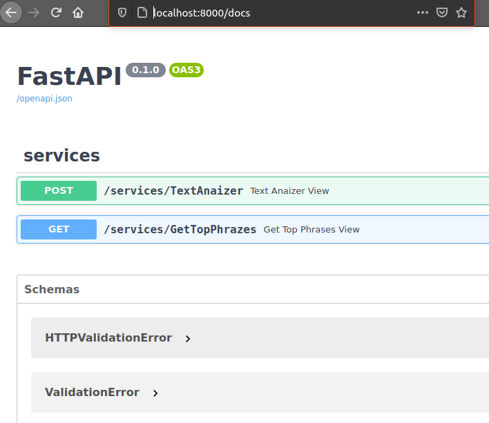
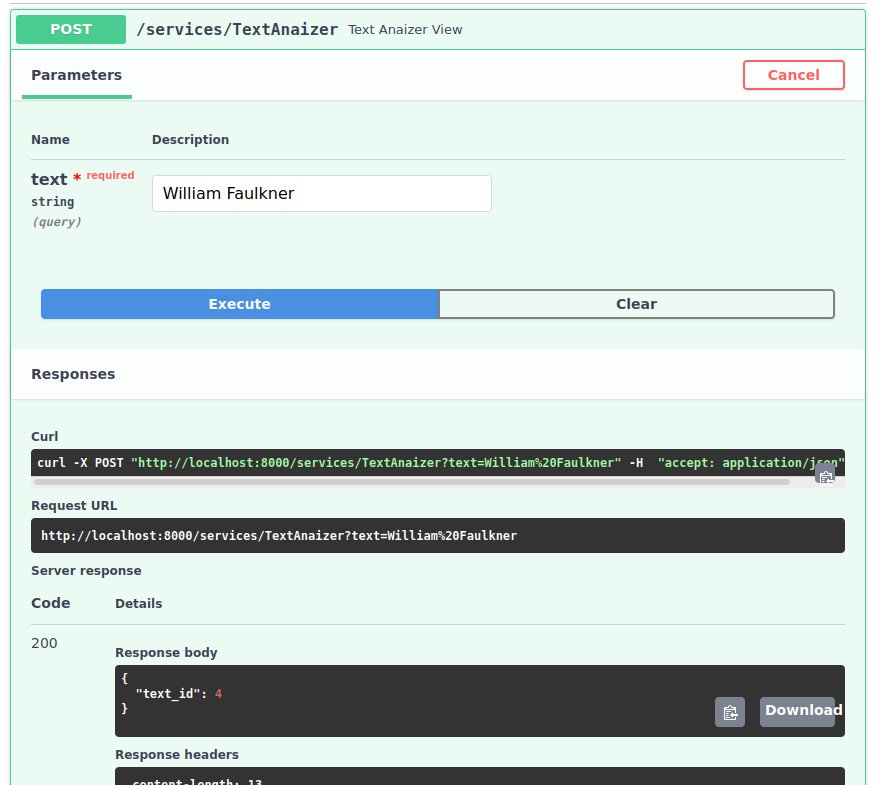
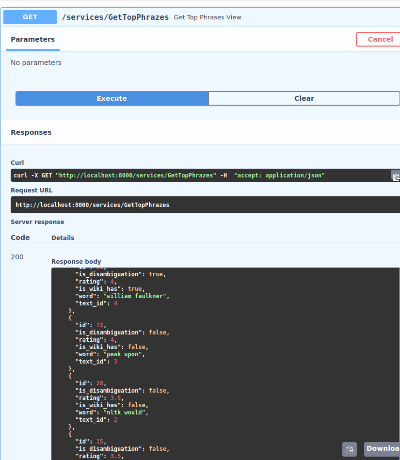

# fastapi_keyphrase_extraction_app

## Run

## Docker-compose run
```docker-compose up --build```

### Make migrations
```docker-compose run web alembic revision --autogenerate -m "init" ```
```docker-compose run web alembic upgrade head```


## Usage

Go to http://localhost:8000/docs (as default)

You should see something like this:


Just put your text iside fiel for analize, it will return text_id that saved in db:


Get all phrases ordered by rating:

